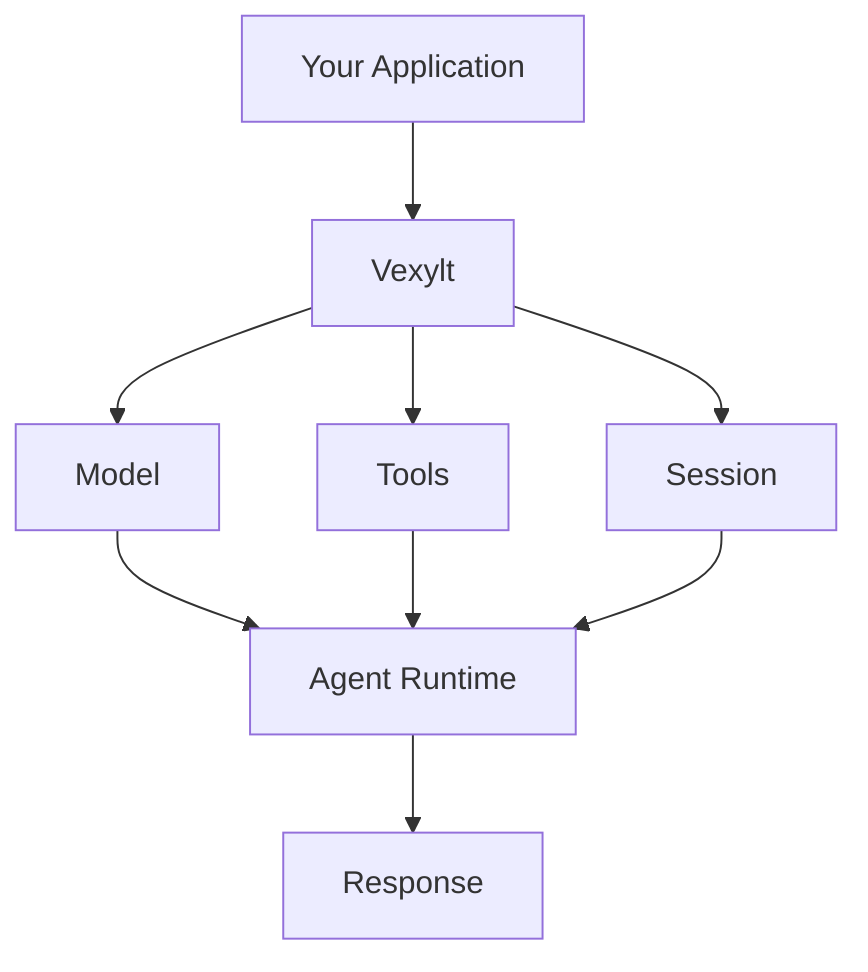
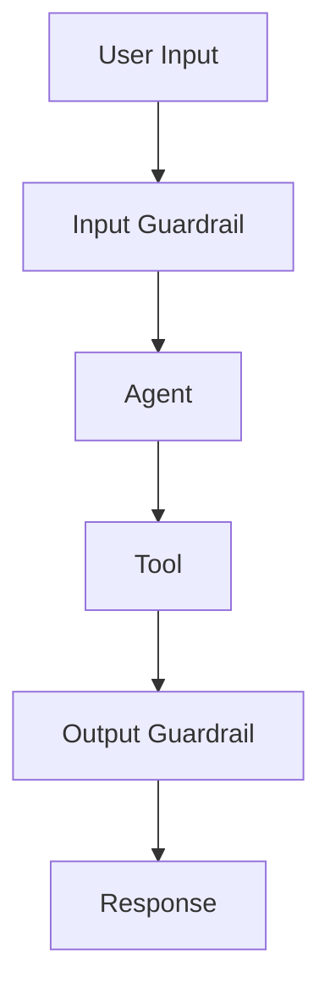
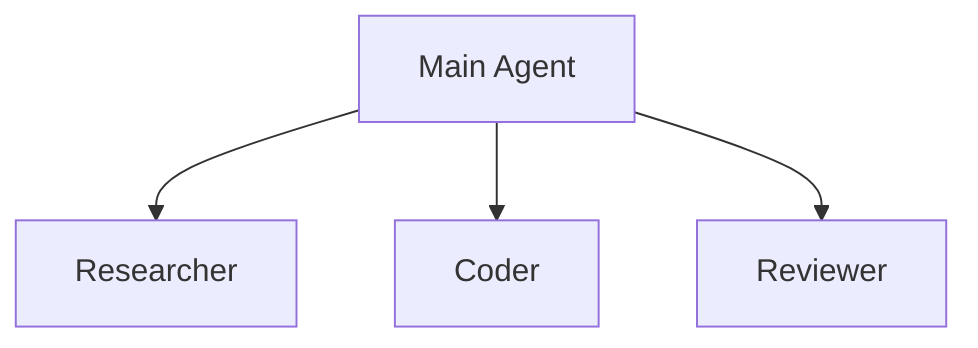
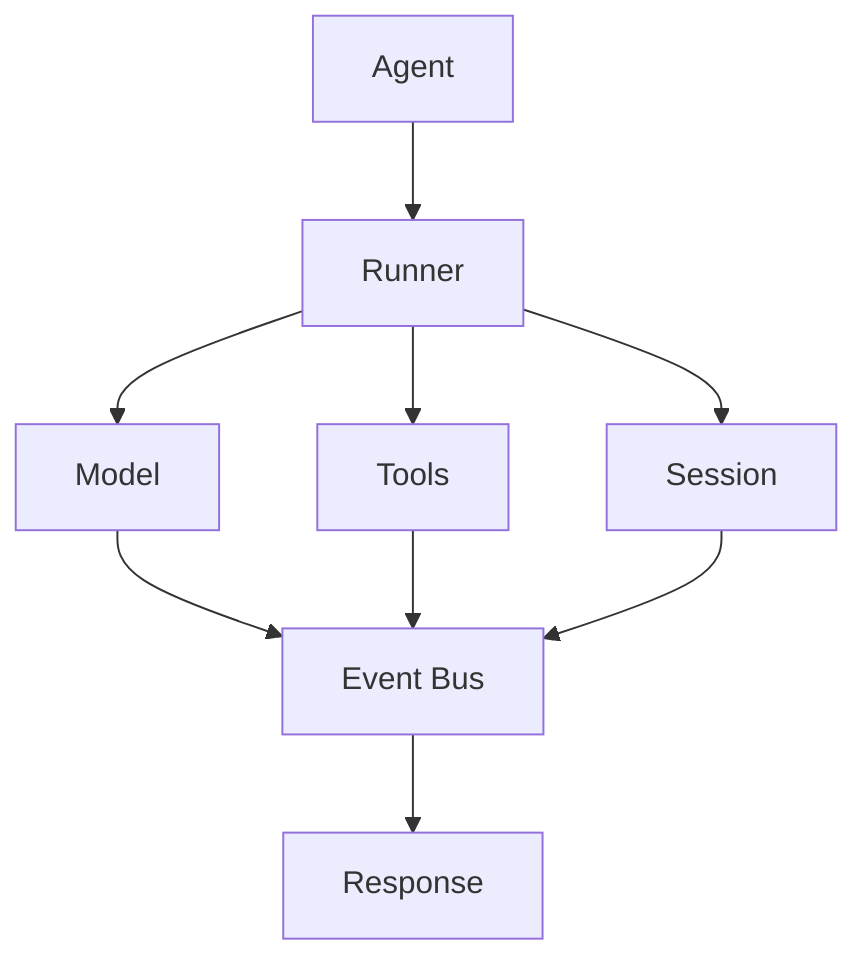
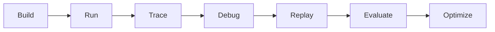

# Vexylt

### Infrastructure for AI Agents.

Vexylt is a developer-first TypeScript SDK for building AI agents with OpenAI.

It provides a simple and extensible API for agents, tools, streaming, sessions, structured outputs, guardrails, and multi-agent workflows — and runs them for you.

> **Build. Run. Ship AI Agents.**

---

## 🚧 Status

**Vexylt is currently in early development.**

The project is being built incrementally, starting with the core Agent SDK before expanding into advanced debugging, observability, evaluation, and optimization capabilities.

The API may change during early releases.

---

## Why Vexylt?

Building an AI agent shouldn't require developers to manually manage model calls, tool execution, conversation state, streaming logic, validation, and error handling.

Vexylt aims to provide a clean abstraction:



Instead of building the agent infrastructure yourself, you can focus on what your agent actually does.

---

## ✨ Features

### 🤖 Core Agent Runtime

Create an agent with a simple API:

```ts
import { Agent } from "@vexylt/agent";

const agent = new Agent({
  name: "ResearchAgent",
  model: "gpt-5",
  instructions: "You are a helpful research assistant."
});

const result = await agent.run(
  "Explain how Redis works."
);

console.log(result.output);
```

---

### 🛠️ Tools

Give agents the ability to interact with your application and external systems.

```ts
import { tool } from "@vexylt/agent";

const calculator = tool({
  name: "calculator",
  description: "Perform mathematical calculations",

  parameters: {
    expression: "string"
  },

  execute: async ({ expression }) => {
    return calculate(expression);
  }
});
```

Then:

```ts
const agent = new Agent({
  name: "MathAgent",
  model: "gpt-5",
  tools: [calculator]
});
```

---

### 🌊 Streaming

Stream agent responses as they are generated.

```ts
const stream = await agent.stream(
  "Explain quantum computing."
);

for await (const chunk of stream) {
  process.stdout.write(chunk);
}
```

---

### 🧠 Sessions & Context

Maintain conversation state across multiple interactions.

```ts
const session = agent.session();

await session.run(
  "My name is Prasanna."
);

await session.run(
  "What is my name?"
);
```

---

### 📦 Structured Outputs

Build agents that return predictable, typed data instead of relying only on plain text responses.

```ts
const result = await agent.run(
  "Analyze this candidate.",
  {
    output: CandidateAnalysis
  }
);
```

---

### 🛡️ Guardrails

Add validation and safety boundaries around agent inputs, outputs, and tools.



---

### 🤝 Multi-Agent Workflows

Compose specialized agents to solve complex tasks.



Multi-agent capabilities will evolve as the SDK matures.

---

## 🗺️ Roadmap

### v0.0.1 — Core SDK

- [ ] Agent
- [ ] OpenAI model integration
- [ ] Runner
- [ ] Tool system
- [ ] Streaming
- [ ] Sessions / context
- [ ] Structured outputs
- [ ] Guardrails
- [ ] Error handling
- [ ] Retries & timeouts
- [ ] Multi-agent basics
- [ ] Execution event system

### Future

The long-term goal is to make AI agents easier to understand, debug, test, and optimize.

Planned capabilities include:

- [ ] 🔍 Agent tracing
- [ ] 🔄 Agent replay
- [ ] ⏪ Agent time-travel
- [ ] 🧪 Agent evaluation
- [ ] 📊 Agent health metrics
- [ ] 💰 Cost optimization
- [ ] 🧠 Automatic failure analysis
- [ ] 📝 Prompt versioning
- [ ] 🔐 Agent permissions
- [ ] ☁️ Vexylt Cloud
- [ ] 🖥️ Vexylt Console

> These features are part of the long-term vision and are not necessarily available yet.

---

## 🏗️ Architecture

Vexylt is designed around a modular agent runtime.



The event system provides an extension point for future observability and debugging capabilities without coupling them directly to the core runtime.

---

## 📦 Installation

> Package publishing is planned as the project approaches its first public release.

```bash
npm install @vexylt/agent
```

---

## ⚡ Quick Start

```ts
import { Agent } from "@vexylt/agent";

const agent = new Agent({
  name: "Assistant",
  model: "gpt-5",
  instructions: "You are a helpful AI assistant."
});

const result = await agent.run(
  "What is an AI agent?"
);

console.log(result.output);
```

---

## 🔑 Environment

Set your OpenAI API key in your environment:

```bash
OPENAI_API_KEY=your_api_key
```

Vexylt uses OpenAI's APIs for model inference.

---

## 🧩 Design Principles

Vexylt is being built around a few principles.

### Simple

The common case should require very little code.

### Extensible

Developers should be able to customize models, tools, sessions, execution, and middleware without fighting the framework.

### Type-safe

TypeScript types should guide developers rather than become an obstacle.

### Observable

The runtime should expose useful execution events so advanced tooling can be built around it.

### Production-minded

Retries, timeouts, validation, cancellation, and predictable execution should be treated as first-class concerns.

---

## 🎯 Vision

Today's goal is simple:

> **Build a great Agent SDK.**

The long-term goal is bigger:

> **Make AI agents as understandable and debuggable as traditional software.**

Vexylt aims to give developers the tools to:



---

## 🤝 Contributing

Vexylt is currently in early development.

Contributions, ideas, issues, and discussions are welcome as the project evolves.

If you find a bug or have an idea:

1. Open an issue.
2. Describe the problem or proposal.
3. Include a minimal reproduction where possible.

---

## 📄 License

License information will be added before the first public release.

---

<p align="center">
  <strong>Vexylt</strong>
  <br />
  Infrastructure for AI Agents.
</p>
